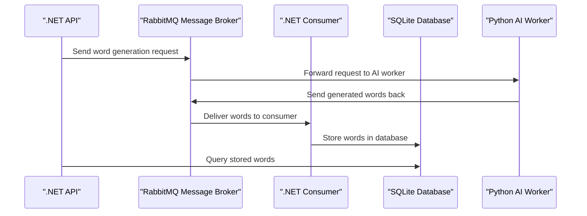

# Dictionary Generator with RabbitMQ Demo

A demonstration project showcasing microservices architecture using .NET, RabbitMQ message broker, and Python AI worker for generating dictionary words.

## Architecture Overview

This project demonstrates a distributed system with the following components:



## Project Structure

```
├── ai/                           # Python AI service for word generation
│   ├── main.py                   # Main worker script
│   ├── lib/generator.py          # OpenAI integration for word definitions
│   ├── models/word.py            # Data models
│   └── requirements.txt          # Python dependencies
├── backend/                      # .NET backend services
│   ├── dictionary.api/           # REST API service
│   ├── dictionary.consumer/      # RabbitMQ consumer service
│   └── dictionary.data/          # Data layer with Entity Framework
├── frontend/                     # React frontend application
│   ├── src/                      # Source code
│   ├── public/                   # Static assets
│   ├── package.json              # Node.js dependencies
│   └── vite.config.js            # Vite configuration
├── docs/                         # Documentation
│   └── flows.mermaid            # Architecture diagrams
├── .env.example                  # Environment variables template
└── docker-compose.yml           # Container orchestration
```

## Features

- **REST API**: .NET 9 Web API for managing dictionary words
- **Message Queue**: RabbitMQ for asynchronous communication
- **AI Word Generation**: Python service using OpenAI GPT-4o-mini to generate dictionary word definitions
- **Data Persistence**: SQLite database with Entity Framework Core
- **Microservices**: Containerized services with Docker
- **Real-time Processing**: Background consumer for processing messages
- **Frontend**: React SPA with Material-UI for user interaction

## Technology Stack

### Backend (.NET)
- **.NET 9**: Latest .NET runtime
- **ASP.NET Core**: Web API framework
- **Entity Framework Core**: ORM with SQLite
- **RabbitMQ.Client**: Message queue integration

### AI Service (Python)
- **Python 3.11**: Runtime environment
- **Pika**: RabbitMQ client library
- **OpenAI GPT-4o-mini**: AI model for generating word definitions
- **Custom AI Generator**: Word generation logic with OpenAI integration

### Frontend (React)
- **React 19**: Latest React version
- **Material-UI (MUI)**: Modern React components
- **Vite**: Fast build tool and dev server
- **Axios**: HTTP client for API calls
- **ESLint & Prettier**: Code quality and formatting

### Infrastructure
- **RabbitMQ**: Message broker with management UI
- **SQLite**: Lightweight database
- **Docker**: Containerization
- **Docker Compose**: Multi-container orchestration

## Quick Start

### Prerequisites
- Docker and Docker Compose
- .NET 9 SDK (for local development)
- Python 3.11+ (for local development)
- OpenAI API key (for AI word generation)

### Running with Docker

1. **Clone the repository**
   ```bash
   git clone <repository-url>
   cd dotnet-rabbitmq
   ```

2. **Setup environment variables**
   ```bash
   # Copy the example environment file
   cp .env.example .env
   
   # Edit .env file and add your OpenAI API key
   # OPENAI_API_KEY=your_actual_api_key_here
   ```

3. **Start all services**
   ```bash
   docker-compose up -d
   ```

4. **Access the services**
   - **Frontend**: http://localhost:3000 (React SPA with Material-UI)
   - **API**: http://localhost:5001
   - **RabbitMQ Management UI**: http://localhost:15672
     - Username: `user`
     - Password: `password`

### API Endpoints

#### Generate Words
```http
POST /api/word/generate
Content-Type: application/json

{
  "word": "example",
  "count": 5
}
```

#### Get Words
```http
GET /api/word
```

#### Get Word by ID
```http
GET /api/word/{id}
```

## Development Setup

### Frontend Development

1. **Navigate to frontend directory**
   ```bash
   cd frontend
   ```

2. **Install dependencies**
   ```bash
   npm install
   ```

3. **Start development server**
   ```bash
   npm run dev
   ```

4. **Build for production**
   ```bash
   npm run build
   ```

5. **Lint and format code**
   ```bash
   npm run lint
   npm run format
   ```

### Backend Development

1. **Navigate to backend directory**
   ```bash
   cd backend
   ```

2. **Restore dependencies**
   ```bash
   dotnet restore
   ```

3. **Run the API**
   ```bash
   cd dictionary.api
   dotnet run
   ```

4. **Run the Consumer (in separate terminal)**
   ```bash
   cd dictionary.consumer
   dotnet run
   ```

### AI Service Development

1. **Navigate to AI directory**
   ```bash
   cd ai
   ```

2. **Install dependencies**
   ```bash
   pip install -r requirements.txt
   ```

3. **Run the AI worker**
   ```bash
   # Set your OpenAI API key first
   export OPENAI_API_KEY=your_api_key_here
   python main.py
   ```

### Database

The project uses SQLite database which is automatically created when the services start. The database file is stored in a Docker volume and persisted between container restarts.

## Environment Configuration

The project includes a `.env.example` file with all required environment variables. Copy it to `.env` and update the values as needed:

```bash
cp .env.example .env
```

The services can be configured using the following environment variables:

### RabbitMQ Configuration
- `RabbitMQ__Host`: RabbitMQ server hostname (default: `rabbitmq`)
- `RabbitMQ__Port`: RabbitMQ server port (default: `5672`)
- `RabbitMQ__Username`: RabbitMQ username (default: `user`)
- `RabbitMQ__Password`: RabbitMQ password (default: `password`)

### Database Configuration
- `ConnectionStrings__Database`: SQLite connection string

### OpenAI Configuration
- `OPENAI_API_KEY`: Your OpenAI API key (required for AI word generation)
- The AI service uses GPT-4o-mini model to generate word definitions, synonyms, antonyms, and example sentences

## Service Communication

1. **API → RabbitMQ**: When a word generation request is made, the API publishes a message to the `words` queue
2. **RabbitMQ → AI Worker**: The Python AI service consumes messages from the queue and generates words
3. **AI Worker → RabbitMQ**: Generated words are published back to RabbitMQ
4. **RabbitMQ → Consumer**: The .NET consumer processes the generated words
5. **Consumer → Database**: Words are stored in the SQLite database
6. **API → Database**: The API queries the database to return stored words

## Message Flow

The system uses RabbitMQ queues for communication:

- **`words` queue**: For word generation requests
- **Message format**: JSON with word and count properties
- **Acknowledgment**: Messages are acknowledged after successful processing

## Monitoring

- **RabbitMQ Management UI**: Monitor queue status, message rates, and connections
- **Logs**: Each service outputs structured logs for debugging
- **Health Checks**: API endpoints for service health monitoring

## Troubleshooting

### Common Issues

1. **Services not starting**: Ensure Docker is running and ports are available
2. **Database connection errors**: Check if SQLite file permissions are correct
3. **RabbitMQ connection failures**: Verify RabbitMQ is running and credentials are correct
4. **AI worker not processing**: Check Python dependencies and RabbitMQ connectivity

### Logs

View logs for specific services:
```bash
docker-compose logs dictionary-api
docker-compose logs dictionary-consumer
docker-compose logs ai-generator
docker-compose logs rabbitmq
```

## Contributing

1. Fork the repository
2. Create a feature branch
3. Make your changes
4. Add tests if applicable
5. Submit a pull request

## License

This project is a demonstration/learning project. Please refer to the license file for usage terms.

---

**Note**: This is a demo project designed for learning microservices architecture with .NET and RabbitMQ. It's not intended for production use without additional security, monitoring, and reliability measures.
